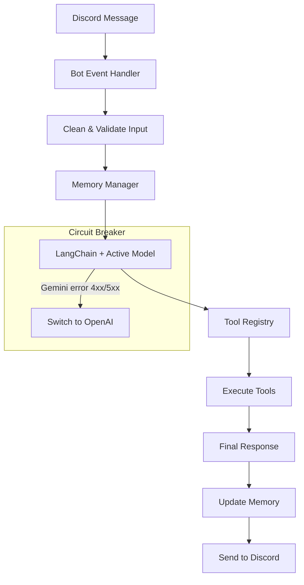

# GaLt - Advanced Discord Bot with LangChain & RAG

An intelligent Discord bot built with TypeScript, Discord.js, LangChain, and OpenAI integration. Features persistent memory using RAG (Retrieval-Augmented Generation) and an extensible tool system for easy customization and expansion.

## Table of Contents
- [Features](#features)
- [Quick Start](#quick-start)
  - [Prerequisites](#prerequisites)
  - [Installation](#installation)
- [Usage](#usage)
- [Project Structure](#project-structure)
- [Creating Custom Tools](#creating-custom-tools)
- [Built-in Tools](#built-in-tools)
  - [Calculator Tool](#calculator-tool)
  - [Time Tool](#time-tool)
  - [Weather Tool (Mock)](#weather-tool-mock)
  - [Random Facts Tool](#random-facts-tool)
- [Memory System (RAG)](#memory-system-rag)
- [Available Scripts](#available-scripts)
- [Environment Variables](#environment-variables)
- [Deployment](#deployment)
  - [Local Development](#local-development)
  - [Production Deployment](#production-deployment)
- [Contributing](#contributing)
- [License](#license)
- [Troubleshooting](#troubleshooting)
  - [Common Issues](#common-issues)
  - [Getting Help](#getting-help)
- [Architecture Overview](#architecture-overview)

## 🌟 Features

- **AI-Powered Conversations**: Uses Gemini by default via LangChain, with automatic failover to OpenAI (GPT‑5‑mini)
- **Persistent Memory**: RAG system maintains conversation context across sessions
- **Tool System**: Extensible framework for adding custom functionality
- **Mention-Based Interaction**: Bot responds when mentioned in channels
- **TypeScript**: Full type safety and modern development experience
- **Bun Runtime**: Fast JavaScript runtime with built-in package management
- **Image Generation**: Generate images via GPT-Image-1 with a clean, single-embed response
- **Web Search**: Live web search using Tavily, compressed to grounded summaries
- **Patience Message**: Auto-posts a “please wait” embed with a cat GIF after a short delay and deletes it when the final answer is sent
- **Circuit Breaker**: Automatic failover from Gemini to OpenAI on specific errors; health-checks and recovery after 10 minutes

## 🚀 Quick Start

### Prerequisites

- [Bun](https://bun.sh) (v1.2.19 or later)
- Node.js (v18 or later) - optional, Bun is preferred
- Discord Bot Token
- Google API Key (Gemini)
- OpenAI API Key
- Tavily API Key (for web search)

### Installation

1. **Clone the repository**
   ```bash
   git clone https://github.com/roshan-c/gaLt.git
   cd gaLt
   ```

2. **Install dependencies**
   ```bash
   bun install
   ```

3. **Set up environment variables**
   ```bash
   cp .env.example .env
   ```
   
   Edit `.env` and add your credentials. See more here: [Environment Variables](#environment-variables)

4. **Run the bot**
   
   Development mode (with hot reload):
   ```bash
   bun run dev
   ```
   
   Production mode:
   ```bash
   bun run start
   ```

## 🎯 Usage

1. **Invite the bot to your Discord server** with message reading permissions
2. **Mention the bot** in any channel: `@YourBot hello there!`
3. **The bot will respond** using AI and maintain conversation context
4. **Use built-in tools** by asking natural questions like:
   - "Calculate 15 + 25"
   - "What time is it in Tokyo?"
   - "Tell me a random science fact"
   - "Generate an image of a red dragon flying over mountains at sunset"

### Image generation behavior
- The bot uses `gpt-image-1` under the hood for image creation.
- One image is generated per user message (duplicate image tool calls are ignored).
- Output is enforced to `1024x1024` with `quality: low` to control cost.
- The reply is a single embed containing:
  - Title
  - Prompt as a header field
  - The image itself
  - A short line: "Here is your image"
- No download link is included. Ensure the bot has the "Attach Files" permission in the channel.

### Patience message behavior
- If a response takes longer than a few seconds (default: ~7s), the bot posts a “Thanks for your patience” embed with a cat GIF from `https://cataas.com/cat/gif`.
- When the final answer is ready (or on error), that patience message is automatically deleted.

### Circuit breaker behavior
- Primary model: Gemini (`{{default model in config}}`).
- If Gemini returns one of these errors: 400, 403, 404, 429, 500, 503, 504 — the circuit breaker trips.
- While tripped, all requests use OpenAI `gpt-5-mini` instead.
- After 10 minutes, a health probe is sent to Gemini; if successful, the bot switches back automatically.

## 🔧 Project Structure

```
gaLt/
├── src/
│   ├── memory/
│   │   └── MemoryManager.ts      # RAG conversation memory
│   ├── tools/
│   │   ├── ToolRegistry.ts       # Tool management system
│   │   ├── ImageGenerationTool.ts # GPT-Image-1 image generation tool
│   │   ├── WebSearchTool.ts      # Live web search with Tavily + OpenAI compression
│   │   └── examples/
│   │       ├── ExampleTool.ts    # Calculator & time tools
│   │       └── WeatherTool.ts    # Weather & facts tools
│   └── types/
│       └── BotConfig.ts          # TypeScript interfaces
├── index.ts                      # Main bot entry point
├── SYSTEM.md                     # System prompt (identity, style, rules)
├── package.json                  # Dependencies & scripts
├── tsconfig.json                 # TypeScript configuration
└── .env.example                  # Environment template
```

## 🛠️ Creating Custom Tools

Tools are the bot's way of performing actions beyond conversation. Here's how to create one:

```typescript
import { z } from 'zod';
import type { BotTool } from '../ToolRegistry';

export const myCustomTool: BotTool = {
  name: 'my_custom_tool',
  description: 'Description of what this tool does',
  schema: z.object({
    parameter: z.string().describe('Parameter description'),
  }),
  execute: async (args: { parameter: string }) => {
    // Your tool logic here
    return { result: 'Tool output' };
  },
};
```

Then register it in `index.ts`:
```typescript
import { myCustomTool } from './src/tools/examples/MyCustomTool';
toolRegistry.registerTool(myCustomTool);
```

## 📚 Built-in Tools

### Calculator Tool
- **Name**: `calculator`
- **Description**: Performs basic arithmetic operations
- **Usage**: "Calculate 42 * 7" or "What's 100 divided by 4?"

### Time Tool
- **Name**: `get_time`
- **Description**: Gets current time in various formats and timezones
- **Usage**: "What time is it?" or "Show me the time in Tokyo"

### Weather Tool (Mock)
- **Name**: `get_weather`
- **Description**: Returns weather information (mock data)
- **Usage**: "What's the weather in New York?"

### Random Facts Tool
- **Name**: `random_fact`
- **Description**: Generates random interesting facts by category
- **Usage**: "Tell me a science fact" or "Random fact about history"

### Web Search Tool
- **Name**: `web_search`
- **Description**: Performs a live search via Tavily and compresses results into a short, grounded summary using OpenAI
- **Usage**: "Search for the best cafes in York, UK" or "What are the latest Node.js LTS changes?"
- **Notes**: Requires `TAVILY_API_KEY`. The response includes a summary, key points, and cited sources.

## 🧠 Memory System (RAG)

The bot maintains conversation context using a simple but effective RAG system:

- **Persistent Memory**: Conversations are stored per user/channel combination
- **Context Limit**: Keeps the last 50 messages to prevent memory overflow
- **Automatic Management**: Old messages are automatically pruned
- **Future-Ready**: Architecture supports vector embeddings and advanced retrieval

## 🔄 Available Scripts

```bash
# Development with hot reload
bun run dev

# Production start
bun run start

# Build for distribution
bun run build

# Run tests
bun run test
```

## 🔐 Environment Variables

| Variable | Description | Required | Default |
|----------|-------------|----------|---------|
| `DISCORD_TOKEN` | Your Discord bot token | ✅ | - |
| `GOOGLE_API_KEY` | Google API key for Gemini | ✅ | - |
| `GOOGLE_MODEL` | Gemini model name | ❌ | `gemini-2.0-flash` |
| `OPENAI_API_KEY` | OpenAI API key (fallback + image generation + compression) | ✅ | - |
| `TAVILY_API_KEY` | Tavily API key for web search | ✅ | - |
| `CHROMA_URL` | ChromaDB URL for RAG memory | ❌ | `http://localhost:8000` |
| `LANGSMITH_API_KEY` | LangSmith tracing key | ❌ | - |
| `LANGSMITH_TRACING` | Enable LangSmith tracing | ❌ | `false` |

## 🚀 Deployment

### Local Development
The bot runs locally and connects to Discord. Perfect for development and testing.

### Production Deployment
For production deployment, consider:

1. **Process Managers**: PM2, systemd, or Docker
2. **Environment**: Ensure all environment variables are set
3. **Monitoring**: Use LangSmith for AI model monitoring
4. **Scaling**: Consider horizontal scaling for high-traffic servers

## 🤝 Contributing

1. Fork the repository
2. Create a feature branch: `git checkout -b feature/amazing-feature`
3. Commit changes: `git commit -m 'Add amazing feature'`
4. Push to branch: `git push origin feature/amazing-feature`
5. Open a Pull Request

## 📝 License

This project is licensed under the MIT License - see the LICENSE file for details.

## 🆘 Troubleshooting

### Common Issues

**Bot doesn't respond to mentions**
- Check that the bot has permission to read messages
- Verify the `MESSAGE_CONTENT` intent is enabled
- Ensure the bot token is correct

**OpenAI API errors**
- Verify your API key is valid and has credits
- Check the model name is supported
- Monitor rate limits

**Multiple responses to a single message**
- Make sure only one bot process is running.
- Hot-reload can add duplicate listeners; this project includes a singleton client and listener guards, plus message ID deduplication.
- If running multiple replicas, add an external deduplication layer (e.g., cache by message ID).

**TypeScript compilation errors**
- Run `bun install` to ensure all dependencies are installed
- Check that your TypeScript version matches requirements

### Getting Help

- Create an issue on GitHub
- Check the Discord.js documentation
- Review LangChain.js documentation
- Consult OpenAI API documentation

## 🏗️ Architecture Overview



Built with ❤️ using Bun, TypeScript, Discord.js, and LangChain.
