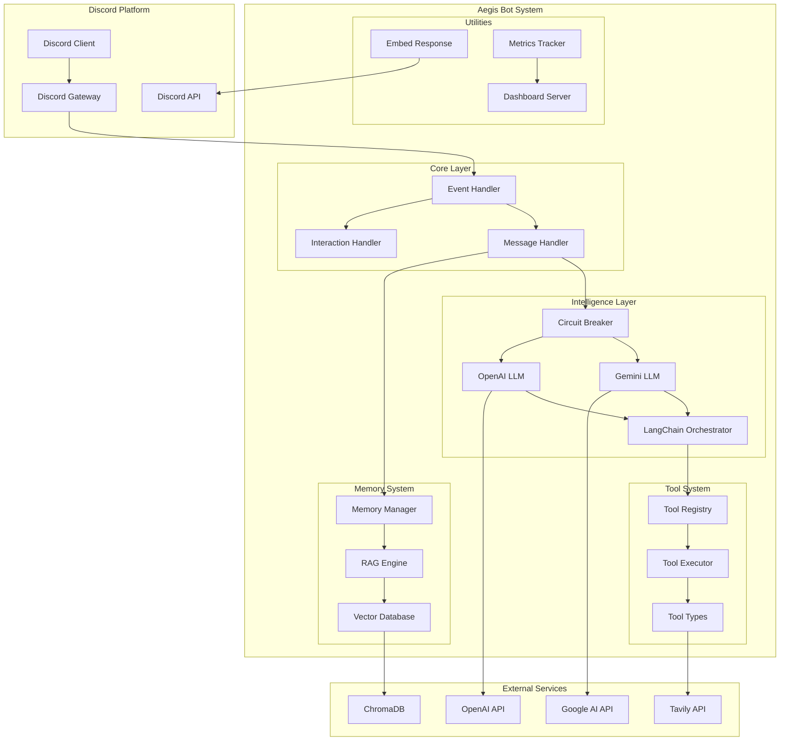
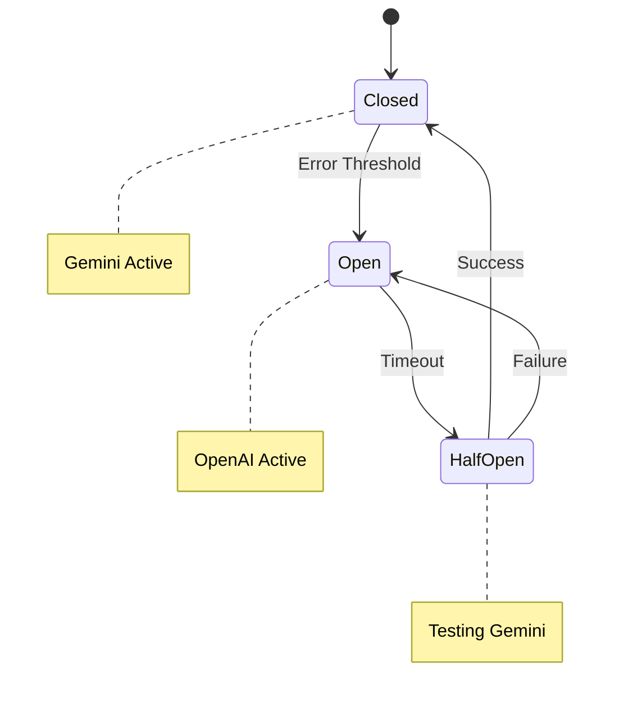
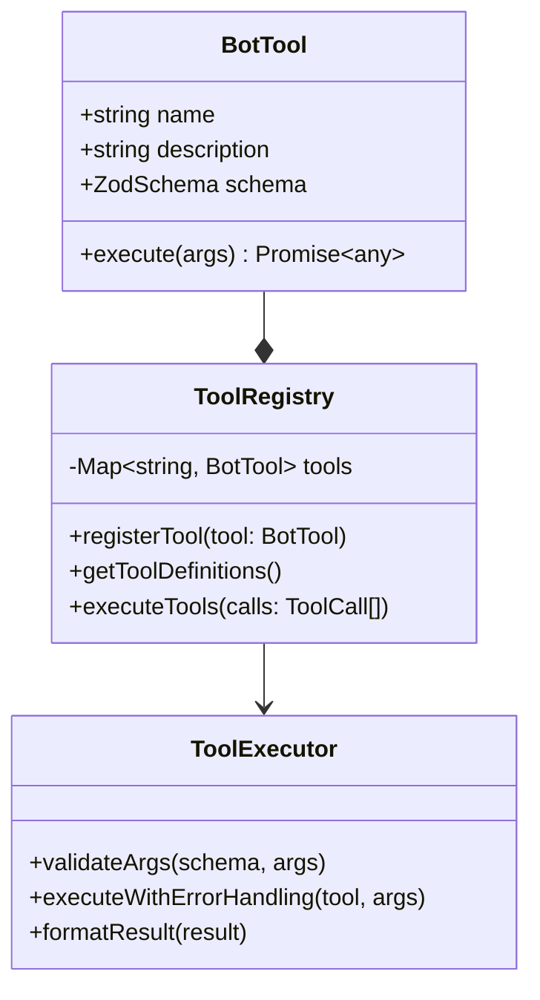
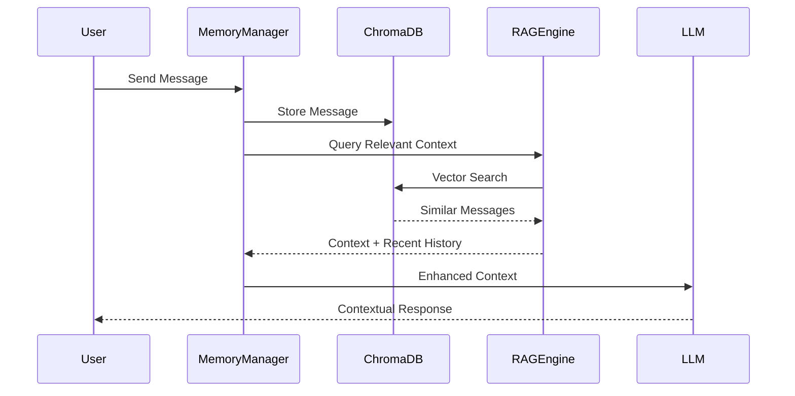
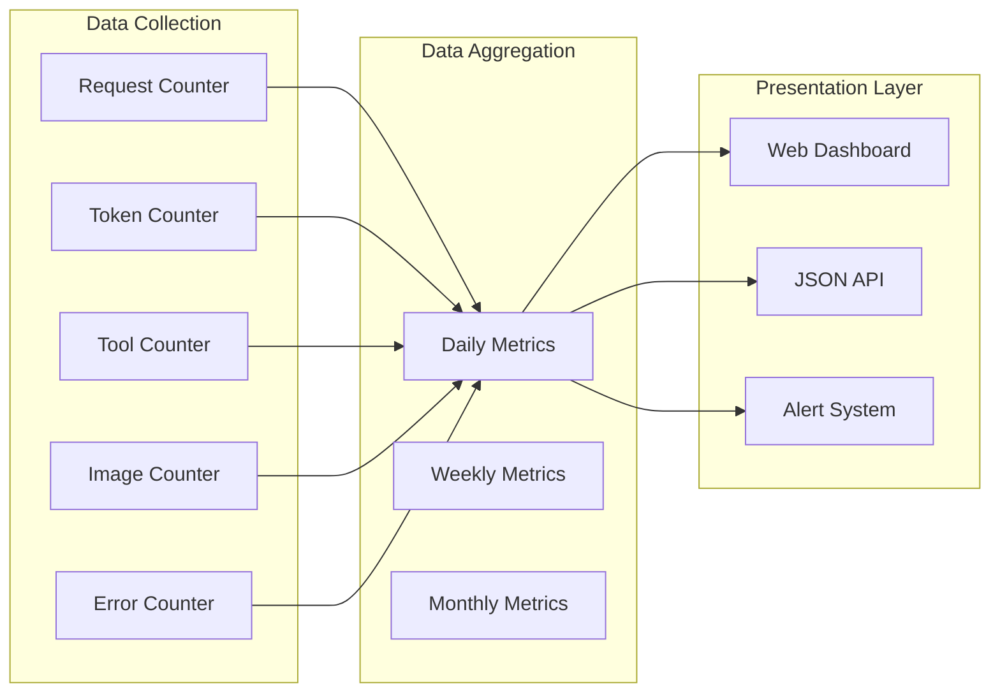
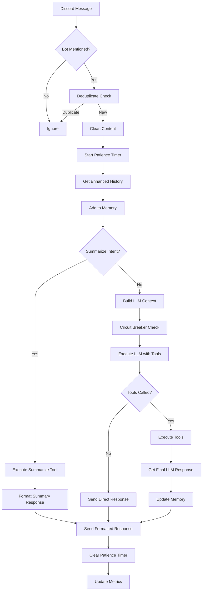
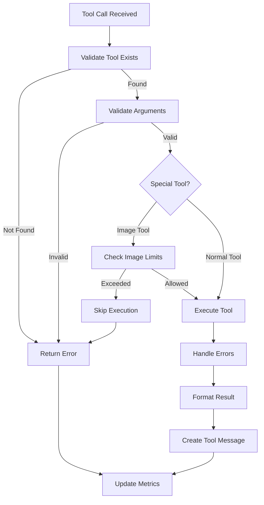
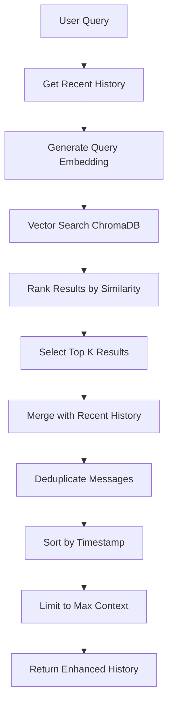
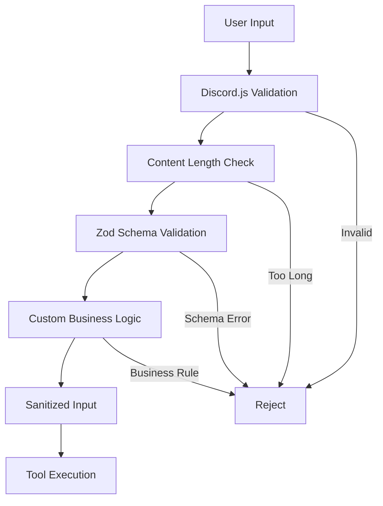

# Architecture Documentation - Aegis Discord Bot

## Table of Contents
- [System Overview](#system-overview)
- [High-Level Architecture](#high-level-architecture)
- [Component Architecture](#component-architecture)
- [Data Flow](#data-flow)
- [Integration Patterns](#integration-patterns)
- [Scalability Design](#scalability-design)
- [Security Architecture](#security-architecture)
- [Performance Considerations](#performance-considerations)
- [Future Architecture](#future-architecture)

## System Overview

Aegis is an intelligent Discord bot built with a modular, extensible architecture that combines multiple AI models with a robust tool system and persistent memory management. The system is designed for high availability, scalability, and maintainability.

### Core Design Principles

1. **Modularity**: Each component has a single responsibility
2. **Extensibility**: New tools and features can be added without core changes
3. **Resilience**: Circuit breaker patterns and graceful failure handling
4. **Performance**: Optimized token usage and response times
5. **Maintainability**: Clear separation of concerns and comprehensive logging

### Technology Stack

- **Runtime**: Bun (primary), Node.js (fallback)
- **Language**: TypeScript with strict type checking
- **Discord Integration**: Discord.js v14
- **AI Orchestration**: LangChain
- **AI Models**: Google Gemini (primary), OpenAI GPT (fallback)
- **Memory Storage**: ChromaDB (vector database)
- **Schema Validation**: Zod
- **Process Management**: PM2 or systemd
- **Containerization**: Docker (optional)

## High-Level Architecture



## Component Architecture

### 1. Event Handler System

The event handler system is the entry point for all Discord interactions, providing hot-reload support and message deduplication.

```typescript
// Architecture Pattern: Singleton with State Preservation
const g: any = globalThis as any;
let client: Client = g.__GA_LT_CLIENT as Client;

// Message Deduplication
const processedMessages: Map<string, number> = g.__GA_LT_PROCESSED_MESSAGES || new Map();
```

**Key Features:**
- **Hot Reload Support**: Preserves state across development restarts
- **Message Deduplication**: Prevents duplicate processing with TTL-based cleanup
- **Event Distribution**: Routes events to appropriate handlers
- **Error Isolation**: Prevents single failures from crashing the entire system

**Responsibilities:**
- Discord client lifecycle management
- Event routing and distribution
- State preservation during development
- Error boundary implementation

### 2. Circuit Breaker Pattern

The circuit breaker provides automatic failover between AI models based on error conditions and health monitoring.

```typescript
// Circuit Breaker State Management
type CircuitState = {
  tripped: boolean;
  untilTs: number | null;
  testTimer?: ReturnType<typeof setTimeout>;
};

// Error-based Tripping
const CB_ERROR_CODES = new Set([400, 403, 404, 429, 500, 503, 504]);
```

**State Diagram:**


**Features:**
- **Automatic Detection**: Monitors API response codes
- **Health Probing**: Tests service recovery every 10 minutes
- **Graceful Degradation**: Seamless fallback to secondary model
- **Recovery Management**: Automatic restoration when service is healthy

### 3. Tool System Architecture

The tool system provides an extensible framework for adding functionality through a registry pattern with schema validation.



**Built-in Tools:**

1. **Calculator Tool**
   - Mathematical operations
   - Input validation
   - Error handling for edge cases

2. **Time Tool**
   - Timezone support
   - Multiple output formats
   - Locale-aware formatting

3. **Weather Tool** (Mock)
   - Structured weather data
   - Location-based responses
   - Unit conversion

4. **Random Facts Tool**
   - Category-based facts
   - Educational content
   - Variety ensuring algorithms

5. **Image Generation Tool**
   - OpenAI DALL-E integration
   - Moderation filtering
   - Cost tracking
   - Single image per message policy

6. **Web Search Tool**
   - Tavily API integration
   - Result summarization
   - Source attribution
   - OpenAI compression

7. **Summarize Context Tool**
   - Conversation history analysis
   - Web search integration
   - Structured output (summary, key points, actions)

### 4. Memory Management System

The memory system implements a RAG (Retrieval-Augmented Generation) architecture for maintaining conversation context.



**Components:**

1. **MemoryManager**
   - Message storage and retrieval
   - Context enhancement with RAG
   - Conversation threading by user/channel
   - Automatic pruning (50 message limit)

2. **ChromaDB Integration**
   - Vector embeddings for semantic search
   - Persistent storage
   - Similarity-based retrieval
   - Collection management

3. **RAG Engine**
   - Query enhancement
   - Context ranking
   - Relevance scoring
   - Result formatting

### 5. Response System Architecture

The response system handles Discord message formatting, chunking, and delivery with comprehensive embed support.

```typescript
// Response Strategy Pattern
interface ResponseOptions {
  title?: string;
  includeContext?: boolean;
  toolsUsed?: string[];
  tokenUsage?: TokenUsage;
  attachments?: any[];
  imagePrompt?: string;
  imageFilename?: string;
}
```

**Features:**
- **Automatic Chunking**: Splits long responses into Discord-compliant chunks
- **Embed Formatting**: Rich embed generation with metadata
- **Attachment Handling**: File attachments with proper MIME types
- **Error Formatting**: Consistent error presentation
- **Patience Messages**: Long-running operation indicators

### 6. Metrics and Monitoring System

The metrics system provides comprehensive tracking and visualization of bot performance and usage.



**Tracked Metrics:**
- **Request Volume**: Total API requests
- **Token Usage**: Input/output/total tokens with cost estimation
- **Tool Execution**: Success/failure rates per tool
- **Image Generation**: Count and cost tracking
- **Response Times**: Performance monitoring
- **Error Rates**: Failure tracking and categorization

## Data Flow

### Message Processing Flow



### Tool Execution Flow



### Memory Enhancement Flow



## Integration Patterns

### 1. External API Integration

The bot integrates with multiple external services using different patterns:

**Google Gemini Integration:**
```typescript
const geminiLlm = new ChatGoogleGenerativeAI({
  apiKey: config.googleApiKey,
  model: config.googleModel,
  temperature: 1,
});
```

**OpenAI Integration:**
```typescript
const openaiLlm = new ChatOpenAI({
  model: 'gpt-5-mini',
  temperature: 1,
});
```

**Tavily Search Integration:**
```typescript
// Web search tool with result compression
const searchResults = await tavilySearch(query);
const compressedResults = await openai.compress(searchResults);
```

### 2. Database Integration Patterns

**ChromaDB Vector Storage:**
```typescript
// Vector embedding and storage
const embedding = await openai.embeddings.create({
  input: content,
  model: 'text-embedding-ada-002'
});

await chromaCollection.add({
  documents: [content],
  embeddings: [embedding.data[0].embedding],
  metadatas: [{ userId, channelId, timestamp }],
  ids: [messageId]
});
```

**Memory Retrieval Pattern:**
```typescript
// Semantic search with metadata filtering
const results = await chromaCollection.query({
  queryEmbeddings: [queryEmbedding],
  nResults: 10,
  where: {
    userId: userId,
    channelId: channelId
  }
});
```

### 3. Discord.js Integration

**Event-Driven Architecture:**
```typescript
// Message events with error boundaries
client.on(Events.MessageCreate, async (message: Message) => {
  try {
    await processMessage(message);
  } catch (error) {
    await sendErrorResponse(message, error);
  }
});
```

**Slash Command Integration:**
```typescript
// Interaction handling with deferred responses
client.on(Events.InteractionCreate, async (interaction) => {
  if (!interaction.isChatInputCommand()) return;
  
  await interaction.deferReply({ ephemeral: true });
  const result = await processInteraction(interaction);
  await interaction.editReply(result);
});
```

## Scalability Design

### 1. Horizontal Scaling Strategies

**Multi-Instance Deployment:**
- Bot sharding for large Discord servers
- Load balancing across multiple processes
- Shared state management with Redis

**Database Scaling:**
- ChromaDB clustering for vector operations
- PostgreSQL for relational data
- Read replicas for improved performance

### 2. Performance Optimizations

**Token Management:**
- Context limiting to prevent excessive token usage
- Conversation pruning with configurable limits
- Smart context selection with RAG

**Caching Strategies:**
- In-memory caching for frequently used data
- Tool result caching with TTL
- Discord embed caching

**Resource Management:**
- Connection pooling for databases
- Rate limiting for expensive operations
- Memory monitoring and garbage collection

### 3. Cost Optimization

**Model Usage Optimization:**
- Circuit breaker reduces expensive API calls
- Context trimming minimizes token usage
- Batch processing for multiple operations

**Resource Allocation:**
- Right-sizing for deployment environment
- Auto-scaling based on usage patterns
- Cost monitoring and alerting

## Security Architecture

### 1. Input Validation and Sanitization



### 2. API Security

**Authentication:**
- Discord Bot Token authentication
- API key management for external services
- Secure environment variable handling

**Authorization:**
- Discord permission validation
- Rate limiting per user/server
- Tool execution permissions

**Data Protection:**
- Sensitive data encryption
- Secure memory handling
- PII data anonymization

### 3. Infrastructure Security

**Network Security:**
- HTTPS enforcement for all communications
- VPN access for management
- Firewall configuration

**Container Security:**
- Non-root user execution
- Minimal base images
- Security scanning

**Secrets Management:**
- Environment variable encryption
- Secret rotation policies
- Access logging

## Performance Considerations

### 1. Response Time Optimization

**Target Metrics:**
- Initial response: < 3 seconds
- Tool execution: < 10 seconds
- Memory retrieval: < 1 second
- Image generation: < 30 seconds

**Optimization Strategies:**
- Async/await patterns for non-blocking operations
- Parallel execution of independent operations
- Streaming responses for long operations
- Patience messages for user experience

### 2. Memory Management

**Conversation Memory:**
- Maximum 50 messages per conversation
- Automatic pruning of old messages
- Efficient vector storage and retrieval

**Application Memory:**
- Process monitoring and alerting
- Memory leak detection
- Garbage collection optimization

### 3. Token Usage Optimization

**Context Management:**
- Smart context selection with RAG
- Recent message prioritization
- System prompt optimization

**Model Selection:**
- Circuit breaker for cost-effective fallback
- Model-specific optimization
- Token counting and budgeting

## Future Architecture

### 1. Planned Enhancements

**Advanced RAG System:**
- Multiple vector stores for different data types
- Hybrid search combining vector and keyword
- Fine-tuned embedding models

**Tool System Evolution:**
- Plugin architecture for third-party tools
- Tool composition and chaining
- Advanced validation and sandboxing

**Multi-Modal Capabilities:**
- Voice message processing
- Video analysis integration
- Document parsing and analysis

### 2. Scalability Roadmap

**Phase 1: Current Architecture**
- Single instance deployment
- Basic tool system
- Simple memory management

**Phase 2: Enhanced Scalability**
- Multi-instance deployment
- Advanced caching
- Performance monitoring

**Phase 3: Enterprise Scale**
- Microservices architecture
- Advanced orchestration
- Multi-region deployment

### 3. Technology Evolution

**Runtime Optimization:**
- Bun adoption for improved performance
- Edge deployment capabilities
- Serverless function integration

**AI Model Integration:**
- Multiple model provider support
- Custom fine-tuned models
- Advanced reasoning capabilities

**Monitoring and Observability:**
- Distributed tracing
- Advanced metrics and alerting
- AI-powered anomaly detection

This architecture provides a solid foundation for current operations while maintaining flexibility for future enhancements and scale requirements. The modular design ensures that components can evolve independently while maintaining system stability and performance.